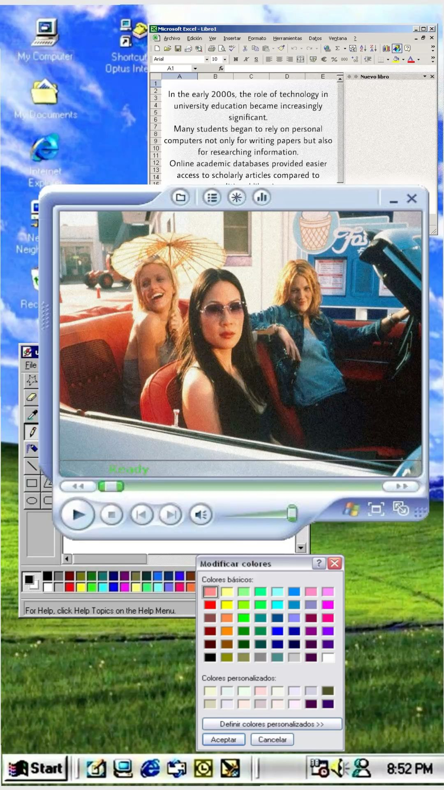

# GPTMarket Generator

[](https://www.python.org/downloads/)
[](https://temporal.io/)
[](https://opensource.org/licenses/MIT)
[](https://www.docker.com/)
[](https://www.npmjs.com/package/@gptmarket/temporal-types)

**AI-powered media generation workflows.** Generate images, videos, and audio with durable, fault-tolerant execution.

Built on [Temporal](https://temporal.io/) for reliable workflow orchestration. Connect from Next.js, Python, or any Temporal client.

**TypeScript/JavaScript?** Install types: `npm install @gptmarket/temporal-types`

## Quick Start

### 1. Configure Environment

```bash
cp .sample.env .env
```

Edit `.env` and fill in your API keys (Replicate, OpenAI, etc.). See [.sample.env](.sample.env) for all available options.

### 2. Start Services

```bash
make start
# or
./start.sh
```

This starts the Temporal server and workers via Docker Compose.

### 3. Test Workflows

```bash
# Run Ruby workflow test
make test-ruby

# Or run all tests
pytest tests/ -v

# Or run specific test file
pytest tests/temporal/manual/test_ruby.py -v
```

For production deployment, see [docs/DEPLOYMENT.md](docs/DEPLOYMENT.md).

---

## Workflows

### Ruby - AI Influencer Reaction Videos

Creates viral short-form content with an AI-generated person showing an emotion. Think TikTok/Reels style.

<p align="center">
  
</p>

**Flow:** Generate person prompt → Generate face → Animate with video model → Slow motion → Text overlay → Media rewrite (optional)

```python
from app.temporal.workflows.generations.ruby import RubyInput, RubyWorkflow

result = await client.execute_workflow(
    RubyWorkflow.run,
    RubyInput(
        emotion='shocked',
        text_overlay="it's 2026 and you're still scrolling tiktok manually",
        gender='female',
        style='coquette',
        background='bedroom',
        aspect_ratio='9:16',
        video_duration=5,
        slowed_video=True,
        rewrite_enabled=True,  # Bypass platform detection
        rewrite_device='iPhone 15 Pro',
    ),
    id='ruby-123',
    task_queue='generation-queue',
)

print(result.final_video_url)  # https://...
```

**Input options:**

| Field | Default | Description |
|-------|---------|-------------|
| `additional_prompt` | None | Optional context or instructions for AI generation |
| `emotion` | `shocked` | `shocked`, `scared`, `surprised`, `worried`, `excited`, `confused`, `disgusted`, `amazed` |
| `text_overlay` | None | Text to display on video |
| `gender` | `female` | `female`, `male` |
| `age_range` | `early_20s` | `teen`, `early_20s`, `mid_20s`, `early_30s`, etc. |
| `ethnicity` | `caucasian` | `caucasian`, `black`, `asian`, `latino`, etc. |
| `hair_color` | `brown` | `black`, `brown`, `blonde`, `red`, etc. |
| `style` | `coquette` | `coquette`, `clean_girl`, `dark_academia`, `streetwear`, etc. |
| `background` | `bedroom` | `bedroom`, `living_room`, `cafe`, `gym`, `beach`, etc. |
| `clothing` | `casual` | `casual`, `streetwear`, `formal`, `athletic`, etc. |
| `aspect_ratio` | `9:16` | `9:16`, `16:9`, `1:1` |
| `video_duration` | `5` | 5-10 seconds |
| `slowed_video` | `True` | Apply slow motion effect |
| `rewrite_enabled` | `False` | Bypass platform duplicate detection |
| `rewrite_device` | None | Device to emulate (e.g., `iPhone 15 Pro`) |

**Output:**

```python
result.face_image_url        # Generated face image
result.raw_video_url         # Video before effects
result.final_video_url       # Final video with all effects
result.enhanced_image_prompt # Prompt used for face
result.enhanced_video_prompt # Prompt used for animation
```

---

### Pinterest Slideshow - Aesthetic Image Collection

Scrapes Pinterest for aesthetic images based on a text prompt. Generates search queries using AI, then scores and filters results.

<p align="center">
  
  
  
</p>

**Flow:** Parse prompt → Generate diverse queries → Scrape Pinterest → Score & select best images

```python
from app.temporal.workflows.generations.slideshows_pinterest import (
    SlideshowsPinterestInput,
    SlideshowsPinterestWorkflow,
)

result = await client.execute_workflow(
    SlideshowsPinterestWorkflow.run,
    SlideshowsPinterestInput(
        prompt='cozy winter cabin aesthetics with warm lighting and hot cocoa vibes',
    ),
    id='pinterest-123',
    task_queue='generation-queue',
)

for img in result.images:
    print(f'{img.title}: {img.image_url}')
```

**Output:**

```python
result.images         # List of PinterestImage objects
result.queries_used   # Search queries that were generated
result.total_scraped  # Total images found before filtering

# Each image has:
img.id           # Pin ID
img.title        # Pin title
img.description  # Pin description
img.image_url    # Direct image URL
img.aspect_ratio # e.g., "9:16"
img.image_width  # Width in pixels
img.image_height # Height in pixels
```

---

## Query Progress

All workflows support querying status and current step:

```python
handle = await client.start_workflow(...)

# Check status
status = await handle.query('get_status')  # RUNNING, COMPLETED, FAILED

# Get current step
step = await handle.query('get_current_step')
print(f'{step.step_name}: {step.progress_pct}%')

# Wait for result
result = await handle.result()
```

---

## Next.js Integration

See [docs/NEXTJS_INTEGRATION.md](docs/NEXTJS_INTEGRATION.md) for the full guide.

```typescript
// app/actions/generate.ts
'use server'

import { Client, Connection } from '@temporalio/client';

export async function startRubyGeneration(emotion: string) {
  const connection = await Connection.connect({
    address: process.env.TEMPORAL_HOST,
  });
  const client = new Client({ connection });

  const handle = await client.workflow.start('RubyWorkflow', {
    taskQueue: 'generation-queue',
    workflowId: `ruby-${Date.now()}`,
    args: [{
      secret_key: process.env.WORKFLOW_SECRET_KEY,
      emotion,
      rewrite_enabled: true,
    }],
  });

  return { workflowId: handle.workflowId };
}
```

---

## Development

```bash
make start      # Start Temporal + worker
make test       # Run tests
make run        # Execute sample workflow
make lint       # Lint with ruff
make format     # Format with ruff
```

### Run Tests

```bash
# Unit tests (no Temporal server needed)
pytest tests/temporal/test_workflows.py -v

# Manual tests (requires running services)
pytest -m manual tests/temporal/manual/ -v
```

### Project Structure

```
app/
├── core/
│   ├── ai_models/      # AI model definitions
│   ├── configs/        # Pydantic Settings
│   ├── providers/      # External API clients
│   └── services/       # FFmpeg, storage, etc.
└── temporal/
    ├── activities/     # Temporal activities
    ├── workflows/
    │   └── generations/    # Workflow definitions
    ├── worker.py       # Worker entry point
    └── client.py       # Client utilities
```

---

## Documentation

See [docs/](docs/) for all guides:

- [Deployment Guide](docs/DEPLOYMENT.md) - Production deployment with Dokploy
- [Next.js Integration](docs/NEXTJS_INTEGRATION.md) - Connect from Vercel

## License

MIT License - see [LICENSE](LICENSE) for details.
